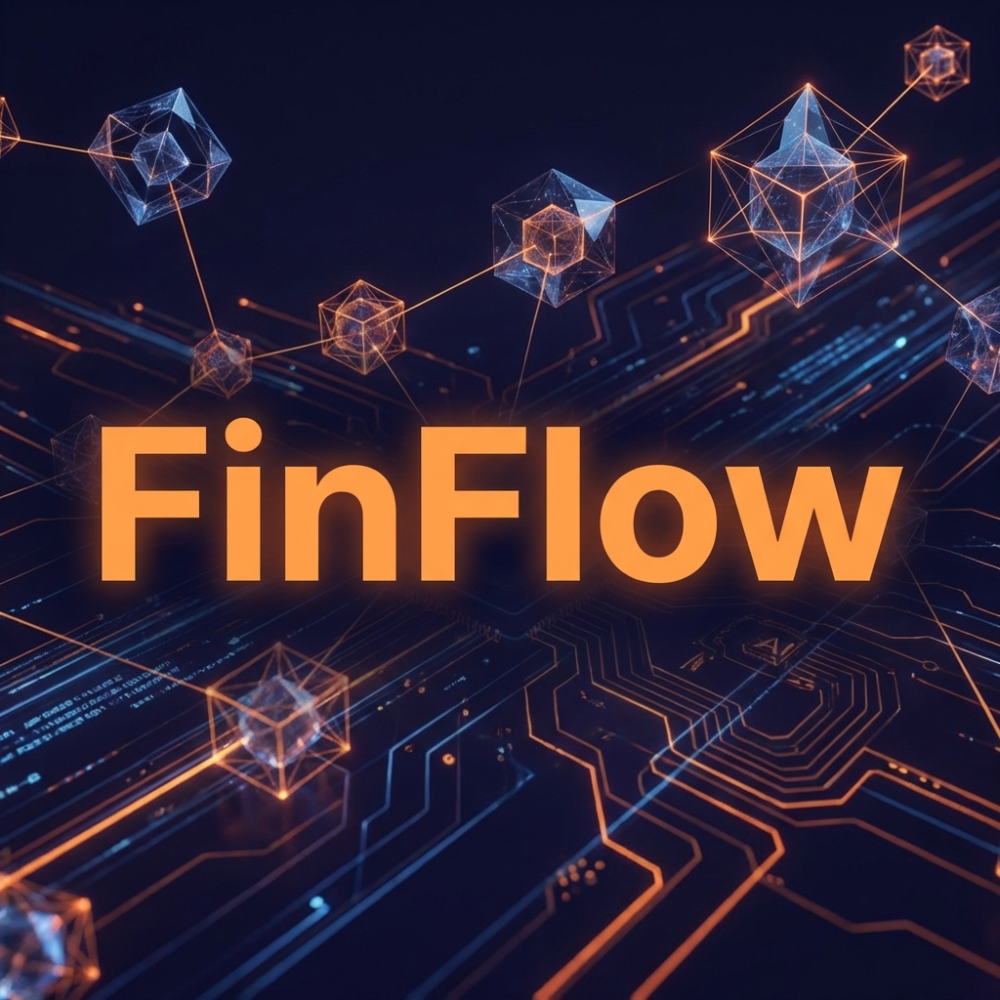
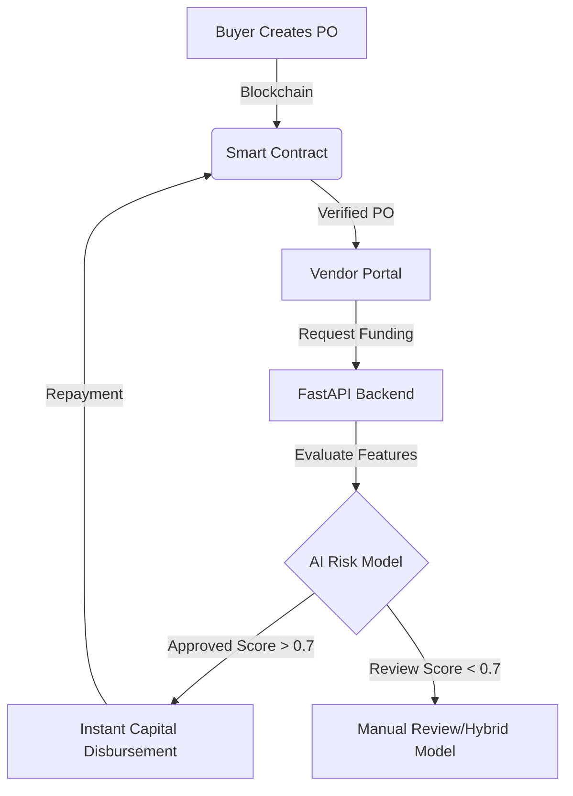

# 

<div align="center">

# 🌊 FinFlow: Open Purchase Order Financing Network
### *Empowering SMEs with AI-Driven, Blockchain-Verified Liquidity*

[](https://github.com/RohithCherukuri816/Open-Purchase-Order-Financing-Network-for-SMEs)
[](https://opensource.org/licenses/MIT)
[](https://github.com/RohithCherukuri816/Open-Purchase-Order-Financing-Network-for-SMEs)

---

**FinFlow** is a next-generation decentralized finance (DeFi) protocol designed to bridge the liquidity gap for Small and Medium Enterprises (SMEs). By leveraging **Ethereum Blockchain** for immutable verification and **Predictive AI** for real-time risk assessment, FinFlow enables vendors to secure instant funding against their Purchase Orders (POs) without traditional banking hurdles.

[Exploration](#-key-features) • [Architecture](#%EF%B8%8F-system-architecture) • [Getting Started](#-installation--setup) • [AI Logic](#-ai-credit-scoring-engine)

</div>

---

## 🚀 Key Features

<table width="100%">
  <tr>
    <td width="50%">
      <h3>🔗 Blockchain Verification</h3>
      <p>Immutable PO creation and status tracking using Solidity smart contracts. Ensures zero-fraud environments for lenders.</p>
    </td>
    <td width="50%">
      <h3>🧠 AI Risk Scoring</h3>
      <p>Real-time credit analysis using Random Forest Regressors to predict repayment probability based on 5+ dynamic factors.</p>
    </td>
  </tr>
  <tr>
    <td width="50%">
      <h3>⚡ Instant Liquidity</h3>
      <p>Vendors can convert validated POs into working capital within minutes, bypassing weeks of manual bank due diligence.</p>
    </td>
    <td width="50%">
      <h3>📊 Lender Analytics</h3>
      <p>Advanced dashboard for capital allocators to monitor ROI, risk distribution, and portfolio health in real-time.</p>
    </td>
  </tr>
</table>

---

## 🛠️ Tech Stack

### **Frontend & UI**
- **React (Vite)**: High-performance SPA architecture.
- **Framer Motion**: Smooth, premium micro-interactions.
- **Lucide React**: Clean, modern iconography.
- **Ethers.js**: Seamless blockchain wallet integration.

### **Backend & Intelligence**
- **FastAPI**: High-concurrency Python backend (Uvicorn).
- **Web3.py**: Direct integration with Hardhat nodes.
- **Scikit-learn**: AI/ML model for credit risk prediction.
- **WebSockets**: Real-time data streaming for live stats updates.

---

## 🏗️ System Architecture



---

## 🤖 AI Credit Scoring Engine

The heart of FinFlow is its **Explainable AI** model. Trained on synthetic datasets mimicking high-growth industrial sectors, the model evaluates:

| Feature | Impact | Logic |
| :--- | :--- | :--- |
| **PO Amount** | 📉 Variable | Larger amounts require higher vendor credibility scores. |
| **Delivery Days** | ⏰ High | Tight deadlines ( < 14 days) increase fulfillment risk. |
| **Vendor Score** | ⭐ Critical | Historical performance and repayment reliability. |
| **Buyer Credibility**| 🏆 High | The financial health of the entity issuing the PO. |
| **Category Risk** | 🏭 Moderate | Industry-specific volatility (e.g., Electronics vs Construction). |

> **Process:** If the AI outputs a **Repayment Probability > 0.7**, the system authorizes an automated funding contract on-chain.

---

## 📥 Installation & Setup

### 1️⃣ Blockchain Node
```bash
cd blockchain
npm install
npx hardhat node
# Separate terminal:
npx hardhat run scripts/deploy.js --network localhost
```

### 2️⃣ AI Engine
```bash
cd ai
pip install pandas numpy scikit-learn joblib
python train_model.py
```

### 3️⃣ Backend API
```bash
cd backend
pip install fastapi uvicorn web3 sqlmodel
uvicorn main:app --reload --port 8000
```

### 4️⃣ Frontend Dashboard
```bash
cd frontend
npm install
npm run dev
```

---

## 📸 Screenshots (Mock)

<div align="center">
  
  <p><i>The premium "FinFlow" Dashboard highlighting Active Capital & Real-time Risk Analytics.</i></p>
</div>

---

<div align="center">

### Built with ❤️ for the future of SME Financing.
[GitHub Repo](https://github.com/RohithCherukuri816/Open-Purchase-Order-Financing-Network-for-SMEs) • [Contact Support](mailto:support@finflow.network)

</div>
